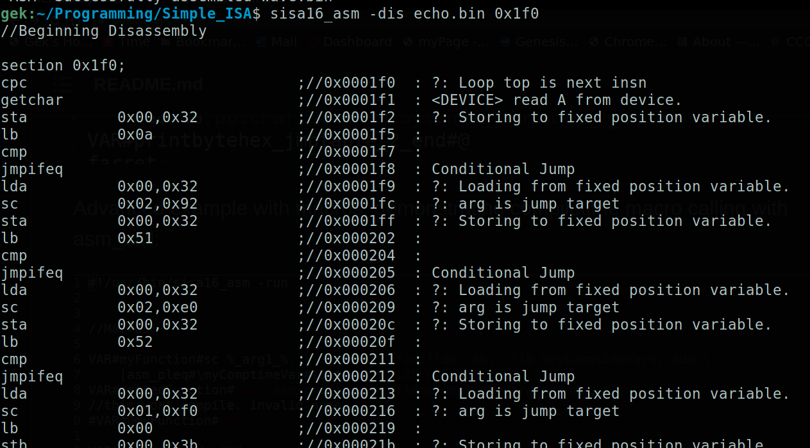

# Replace the CPU!

SISA16 is a lightweight high-performance minimal virtual machine designed for the replacement of the host CPU.

In this repository i have provided the assembler, emulator, disassembler, debugger, and an example kernel and standard library.

The assembler has the emulator built-in so that programs can be executed as scripts.

Platforms Tested and confirmed for 100% compliance:

```
	Windows 10 x86_64 (i7-6700) on MSYS2
	Windows 10 x86_64 (i7-6700) on WSL2
	Debian 11 x86_64 (i7-6700)
	Raspbian ArmV8 (BCM2837B0)
	Debian 11 IA32 (i7-6700)
	Alpine Linux IA32 (JSlinux)
	Buildroot Linux Riscv64 (JSLinux)
```

Platforms planned to be tested:

```
	Debian ppc32
	(any) ppc64
	(any) ppc64le
	(any) Mips64el
	(any) Mips64be
	(any) Mips64le
	Sega Naomi Hitachi Sh-4
```

## Why is SISA16 special?

* Minimal dependence on the host operating system. A very minimal C standard library will build the assembler
	and emulator just fine.

* CPU architecture independence- The behavior of the VM is host-independent. There are only two behaviors which may vary by architecture:
	* Floating point numbers. Their layout in memory may vary, although IEEE-754 compliance is nearly ubiquitous...

	* Signed integers. Non-twos-complement architectures are not supported, and the sign bit must be the highest bit.

	(Luckily, virtually every architecture around today guarantees both of these things.)

	* Execution time. Slower processors run code slower.

	The emulator and assembler are confirmed to work on literally dozens of architectures and operating systems.

* Unique. SISA16 is no ordinary virtual machine language. It has full preemption.

* Trivially embeddable. Implement five small and easy-to-understand functions in a single header file
	to add SISA16 scripting to any system.

* Ready for deployment. Assembler, Debugger, Disassembler, Kernel, manuals. Everything is here.

* Documented. Manpages and developer manual are provided in this repository along with examples.

* Public domain. 

## How fast is it?
______________________________

I wrote a simple program called "rxincrmark" which calculates how long it takes in milliseconds
for a busy loop to make 2.1 billion iterations.

it's similar to the Linux kernel's idea of "Bogomips".

I wrote this program both in sisa16 assembly language, to run on top of krenel,
and on WSL2 on my main development machine.

Running native code with the optimizer on, on my skylake machine, 
I ran the test 6 times and got these numbers:


```
	rxincrmark.c, gcc, -O3, volatile variable:
	5712
	5795
	5861
	5660
	5640
	5645
```

the average number of milliseconds for the native code was 5718.8333333333

Using a user-mode program written in SISA16 which runs on KRENEL,

I got these results:

```
	rxincrmark.asm,
	sisa16 userland code
	
	13088
	12868
	12820
	13144
	13007
	13111
```

the average number of milliseconds for the sisa16 code on the same machine was 13006.33333333

13006.3333 / 5718.8333 is 2.274.

So the emulator, running a user-mode program, in WSL2, is about 1/2.27 the speed of the native code.

Or slightly less than half the speed of native code.

For reference, here is how other emulators/interpreters hold up given the same test:

_________________________________________________________
Lua 5.4 (granularity is seconds, getting milliseconds was too complicated):

```
	rxincrmark.lua
	
	103000
	 94000
	 96000
	106000
```

Average of 99750 milliseconds.

99750/5718.83333 = 17.44, or 1/17.44 the sped

_________________________________________________________
Python 3.9.2

(This took a long time...)

```
	rxincrmark.py
	
	149111.831
	147932.991
	173889.139
	153685.489
```
Average of 156154.8625 ms

156154.8625/5718.83333 = 27.305

about 1/27.3 of the speed of native.


Build Statuses:

gek169/Simple_ISA:

Ubuntu (x86_64):


C-Chads/Simple_ISA:

Ubuntu (x86_64):


This repository contains the SISA16 standalone emulator source, 
the macro assembler/disassembler which doubles as an emulator,

# What does the Assembly language look like?

See the included programs. they are named ".asm"

header libraries are postfixed with ".hasm"

precompiled libraries are postfixed ".bin"

The disassembly looks like this:




# Notable Features and Limitations

* Two privilege rings 

* the registers a, b, c, and the program counter are 16 bit. the program counter region is 8 bit.

* RX0-3 are 32 bit.

* No MOV instruction, SISA16 is a load/store RISC.

* 16 bit segmented memory model

* Single-threaded

* Roughly similar performance in the virtual machine with unoptimized or optimized builds of the VM.

* Uses computed goto on supported compilers, define USE_COMPUTED_GOTO

# Why?

Code written for Sisa16 is not only infinitely portable and fairly fast, but can easily be translated into any programming
language.

Read the documentation for more information.

sisa16_asm.1

Manual.odt

```
Written by
~~~DMHSW~~~
for the public domain
~~~~~~~~~~~~~~~~~~~~~~~~~~~~~~~~~~~~~~~~~
~~Let all that you do be done with love~~
~~~~~~~~~~~~~~~~~~~~~~~~~~~~~~~~~~~~~~~~~

```
